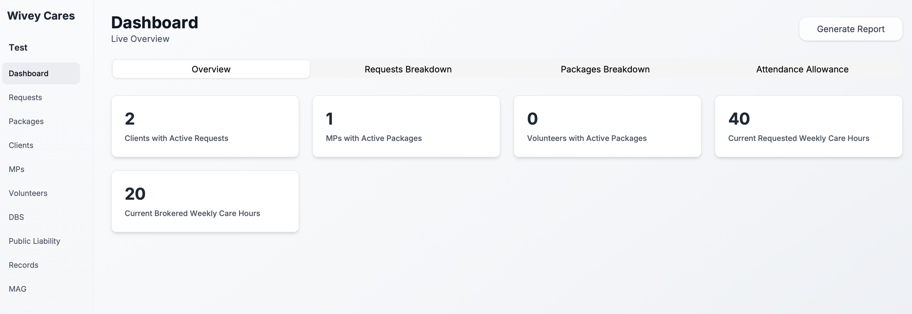
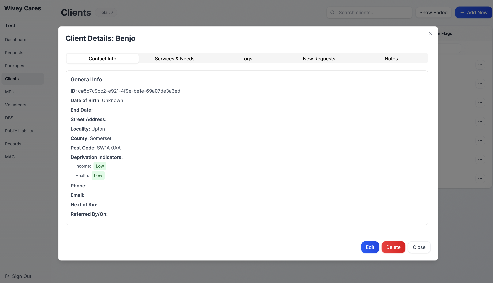
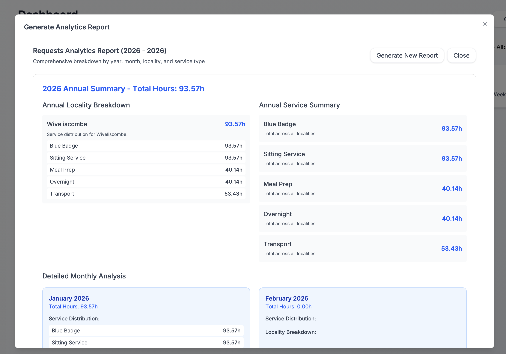

# Paddock

Paddock is a case-management system designed for community-based care coordination, specifically built to support the microprovider model of care. It tracks clients, volunteers, microproviders (MPs), care requests, packages, training records, and MAG (Memory Activity Group) logs through an intuitive TypeScript monorepo with React frontend, tRPC backend, and AWS CDK infrastructure.

**Live site**: [paddock.health](https://paddock.health)

## The Microprovider Model

Paddock directly supports [WiveyCares](https://wiveycares.net), a pioneering charity-run matching service operating in Wiveliscombe, Somerset. WiveyCares supports the self-employed microprovider care model championed by [Somerset County Council](https://www.somerset.gov.uk/care-and-support-for-adults/somerset-micro-enterprise-project/) - which has created over 1,250 micro-providers delivering 30,000+ hours of weekly support to nearly 6,000 people across the county.

**Important**: WiveyCares is a matching service, not an employer. Microproviders remain self-employed, maintaining their independence while benefiting from community coordination and administrative support.

### What are Microproviders?

Microproviders are self-employed local carers operating small, community-based care services with no more than eight workers, completely independent of larger organisations. They provide:
- Personal, flexible and responsive support
- Support to live independently at home
- Day support and help around the home
- Short breaks and socialisation activities
- Transport and access to community services

Unlike traditional care agencies, microproviders are not CQC-regulated medical professionals. They fill the vital space between informal care from friends/family and formal agency care - offering personalized, community-centered support from people who know the local area and residents well.

### The Village-Centered Innovation

While Somerset has pioneered the microprovider model at a county level, **WiveyCares innovates by centering this model at the village level** rather than county-wide coordination. This hyperlocal approach creates:

- **Higher Reputational Capital**: Village coordinators personally know both clients and carers, building deeper trust
- **Better Quality Matching**: Local knowledge enables nuanced matching based on personalities, needs, and community ties
- **Stronger Community Cohesion**: Care relationships strengthen existing village networks rather than importing external support
- **Responsive Coordination**: Village-scale enables rapid response and personal touch impossible at county scale

A trusted part-time village coordinator serves as the community hub, who:
- Personalises matching between clients and microproviders
- Manages onboarding (DBS checks, tax reminders, training)
- Signposts new care requests to available microproviders
- Maintains community trust as the first point of contact

This **villagers caring for villagers** model has proven superior to Somerset's county-wide brokerage tool because village-level coordination keeps information current, leverages deep local knowledge, and maintains the personal relationships that make community care effective.

**Paddock's Role**: While WiveyCares manages matching through personal relationships and mailing lists (which works well), coordinators faced legacy database systems that made data queries painful - especially when preparing funding applications requiring aggregate statistics across 100+ client entries. Paddock provides a modern database and analytics layer to 10x querying efficiency and support the coordination work that makes this model successful.

## Features

### Dashboard Analytics
Get real-time insights into your care operations with comprehensive analytics at a glance:
- **Active Requests Tracking**: Monitor clients with active care requests (2 shown in example)
- **Care Provider Utilization**: Track microproviders (MPs) and volunteers with active packages (1 MP, 0 volunteers shown)
- **Care Hours Management**: View current requested (40h) vs. brokered (20h) weekly care hours
- **Resource Allocation**: Identify gaps between care demand and supply to optimize scheduling

### Client Management with Deprivation Indicators
Track comprehensive client information with automatic deprivation analysis:
- **Contact & Service Information**: Complete client profiles with contact details, services needed, and care history
- **Automatic Deprivation Assessment**: Postcodes are automatically checked against the UK Government's [English Indices of Deprivation 2025](https://www.gov.uk/government/statistics/english-indices-of-deprivation-2025/english-indices-of-deprivation-2025-statistical-release) to identify income and health deprivation levels
- **Request & Package Tracking**: View all care requests and packages associated with each client
- **Notes & Documentation**: Maintain detailed care notes and important client information

### Advanced Analytics Reporting
Generate detailed reports breaking down care hours by multiple dimensions:
- **Service Breakdown**: Hours analyzed by service type (Blue Badge, Sitting Service, Meal Prep, Overnight, Transport)
- **Locality Analysis**: Coverage across the [10 parishes of Wiveliscombe](https://wiveliscombe.com/parishes/) including Wiveliscombe, and surrounding areas
- **Cross-Dimensional Insights**: Service distribution within each locality to identify local care patterns
- **Temporal Trends**: Monthly and annual summaries with year-over-year comparisons
- **Exportable Reports**: Generate comprehensive PDF reports for trustees and stakeholders

## High-level architecture

- **Client (`client/`)**: Vite + React + TypeScript. Talks to the server via tRPC. UI is organized into forms, tables, and modals for the main entities (clients, volunteers, MPs, requests, packages, training, MAG logs).
- **Server (`server/`)**: TypeScript, structured around a **repository + service** pattern:
  - **Repositories**: thin DynamoDB data-access layers (query/put/delete). Each entity has its own repository in `server/db/<entity>/repository.ts`.
  - **Services**: business logic and validation. They parse inputs with Zod schemas (from `shared/`) and call repositories. Shared middleware `addDbMiddleware` stamps `updatedAt`/`updatedBy`.
  - **Schemas**: Zod definitions live under `shared/schemas` and mirrored DB shapes live in `server/db/*/schema.ts`.
  - **Routing**: tRPC routers under `server/trpc` expose the service methods to the client.
- **Shared (`shared/`)**: Common Zod schemas, types, and constants used by both client and server to keep validation aligned.
- **Infrastructure (`infra/`)**: AWS CDK stack that provisions the DynamoDB tables and supporting resources. `infra/lib/database.ts` defines the main table (`WiveyCares2`) and its GSIs; `infra/lib/edge.ts`/`images.ts` cover ancillary pieces.
- **Data ingestion (`server/scripts/`)**: utility scripts such as `preprocess-deprivation.ts` to load external datasets.

## Data model (DynamoDB)

See `docs/DATA.md` for the full column list and GSIs. In brief:

- Primary table `WiveyCares2` uses `pK`/`sK` keys and `entityType` discriminators to store all domain entities (clients, volunteers, MPs, requests, packages, training records, MAG logs).
- Supporting table `DeprivationCompact` (model `IndicesOfDeprivation2025`) stores postcode-level deprivation deciles.

## Local development

- Client: `cd client && npm install && npm run dev`
- Server: `cd server && npm install && npm run dev` (tRPC + DynamoDB local)
- Infra: `cd infra && npm install && npm run cdk synth` (requires AWS creds/CDK bootstrap)

## Testing

- Server tests: `cd server && npm test`
- Infra tests: `cd infra && npm test`

## Conventions

- Code-first validation with Zod; types inferred from schemas.
- Repository/service split: keep Dynamo queries isolated in repositories; keep business logic and validation in services.
- Shared types live in `shared/` and are imported by both client and server to avoid drift.
